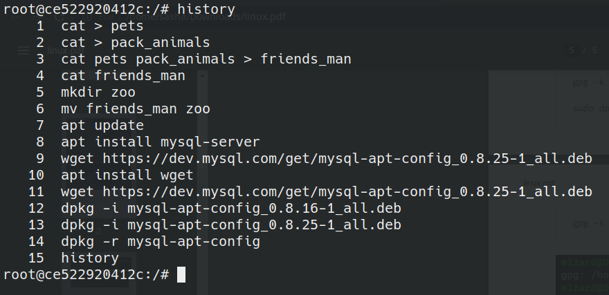

## Задание
1. Используя команду cat в терминале операционной системы Linux, создать
два файла Домашние животные (заполнив файл собаками, кошками,
хомяками) и Вьючные животными заполнив файл Лошадьми, верблюдами и
ослы), а затем объединить их. Просмотреть содержимое созданного файла.

```sh
cat > pets
dogs
cats
hamsters
```
```sh
cat > pack_animals
horses
camels
donkeys
```
```sh
cat pets pack_animals > friends_man
```
```sh
cat friends_man
```

Переименовать файл, дав ему новое имя (Друзья человека).
2. Создать директорию, переместить файл туда.

```sh
mkdir zoo
```
```sh
mv friends_man zoo
```

3. Подключить дополнительный репозиторий MySQL. Установить любой пакет из этого репозитория.

```sh
# Не используется устаревшее
# add-apt-repository 'deb http://repo.mysql.com/apt/ubuntu/ focal mysql-8.0'

apt update
apt install mysql-server
```

4. Установить и удалить deb-пакет с помощью dpkg.

```sh
wget https://dev.mysql.com/get/mysql-apt-config_0.8.25-1_all.deb
dpkg -i mysql-apt-config_0.8.16-1_all.deb
```
5. Выложить историю команд в терминале ubuntu



6. Нарисовать диаграмму, в которой есть класс родительский класс, домашние
животные и вьючные животные, в составы которых в случае домашних
животных войдут классы: собаки, кошки, хомяки, а в класс вьючные животные
войдут: Лошади, верблюды и ослы.

[Alt text](images/1.png)


7. В подключенном MySQL репозитории создать базу данных “Друзья
человека”

```sql
DROP DATABASE IF EXISTS `friends_man`;

CREATE DATABASE IF NOT EXISTS `friends_man`;
```

8. Создать таблицы с иерархией из диаграммы в БД

```sql
USE `friends_man`;

CREATE TABLE `animals` (
  id INT UNSIGNED NOT NULL AUTO_INCREMENT PRIMARY KEY UNIQUE,
  animals_class VARCHAR(30)
);
```

```sql
CREATE TABLE `dogs` (
   id INT UNSIGNED NOT NULL AUTO_INCREMENT UNIQUE,
  `name` VARCHAR(50) NOT NULL,
  `skills` VARCHAR(100) NOT NULL,
  `birth_date` DATE NOT NULL,
  `animal_class_id` INT UNSIGNED NOT NULL,
  FOREIGN KEY (`animal_class_id`) REFERENCES `animals` (`id`) ON DELETE CASCADE
);

CREATE TABLE `cats` (
   id INT UNSIGNED NOT NULL AUTO_INCREMENT UNIQUE,
  `name` VARCHAR(50) NOT NULL,
  `skills` VARCHAR(100) NOT NULL,
  `birth_date` DATE NOT NULL,
  `animal_class_id` INT UNSIGNED NOT NULL,
  FOREIGN KEY (`animal_class_id`) REFERENCES `animals` (`id`) ON DELETE CASCADE
);

CREATE TABLE `hamsters` (
   id INT UNSIGNED NOT NULL AUTO_INCREMENT UNIQUE,
  `name` VARCHAR(50) NOT NULL,
  `skills` VARCHAR(100) NOT NULL,
  `birth_date` DATE NOT NULL,
  `animal_class_id` INT UNSIGNED NOT NULL,
  FOREIGN KEY (`animal_class_id`) REFERENCES `animals` (`id`) ON DELETE CASCADE
);

CREATE TABLE `horses` (
   id INT UNSIGNED NOT NULL AUTO_INCREMENT UNIQUE,
  `name` VARCHAR(50) NOT NULL,
  `skills` VARCHAR(100) NOT NULL,
  `birth_date` DATE NOT NULL,
  `animal_class_id` INT UNSIGNED NOT NULL,
  FOREIGN KEY (`animal_class_id`) REFERENCES `animals` (`id`) ON DELETE CASCADE
);

CREATE TABLE `camels` (
   id INT UNSIGNED NOT NULL AUTO_INCREMENT UNIQUE,
  `name` VARCHAR(50) NOT NULL,
  `skills` VARCHAR(100) NOT NULL,
  `birth_date` DATE NOT NULL,
  `animal_class_id` INT UNSIGNED NOT NULL,
  FOREIGN KEY (`animal_class_id`) REFERENCES `animals` (`id`) ON DELETE CASCADE
);

CREATE TABLE `donkeys` (
   id INT UNSIGNED NOT NULL AUTO_INCREMENT UNIQUE,
  `name` VARCHAR(50) NOT NULL,
  `skills` VARCHAR(100) NOT NULL,
  `birth_date` DATE NOT NULL,
  `animal_class_id` INT UNSIGNED NOT NULL,
  FOREIGN KEY (`animal_class_id`) REFERENCES `animals` (`id`) ON DELETE CASCADE
);
```

9. Заполнить низкоуровневые таблицы именами(животных), командами
которые они выполняют и датами рождения

```sql
INSERT INTO `friends_man`.`animals` (`id`, `animals_class`) VALUES ('1', 'pet'),('2', 'wild');

INSERT INTO `friends_man`.`dogs` (`name`, `skills`, `birth_date`, `animal_class_id`) VALUES
  ('Cherry', 'Sit, Stay, Fetch', '2019-02-10', 1),
  ('Bluebell', 'Roll over, Shake hands', '2018-06-15', 1),
  ('Starlight', 'Play dead, Jump', '2020-01-05', 1),
  ('Flicker', 'Speak, Catch', '2017-09-20', 1),
  ('Luna', 'Bark, Spin', '2016-12-08', 1);

INSERT INTO `friends_man`.`cats` (`name`, `skills`, `birth_date`, `animal_class_id`) VALUES
  ('Chicka', 'Purr, Pounce', '2018-04-25', 1),
  ('Leo', 'Groom, Sleep', '2019-07-10', 1),
  ('Beauty', 'Climb, Hunt', '2020-03-17', 1),
  ('Lily', 'Stretch, Chase', '2017-11-30', 1),
  ('Ruby', 'Meow, Play', '2016-09-12', 1);

INSERT INTO `friends_man`.`hamsters` (`name`, `skills`, `birth_date`, `animal_class_id`) VALUES
  ('Coco', 'Run on the wheel', '2021-01-03', 1),
  ('Jasmine', 'Hide food, Burrow', '2022-02-14', 1),
  ('Reo', 'Climb tubes', '2020-11-20', 1),
  ('Dreamy', 'Cheek pouches, Dig', '2019-10-05', 1),
  ('Azel', 'Gnaw, Explore', '2023-04-01', 1);

INSERT INTO `friends_man`.`horses` (`name`, `skills`, `birth_date`, `animal_class_id`) VALUES
  ('Gravity', 'Gallop, Jump', '2015-08-20', 2),
  ('Isy', 'Trot, Lunge', '2016-06-10', 2),
  ('Apollo', 'Dressage, Canter', '2017-03-15', 2),
  ('Galaxy', 'Trail riding, Vaulting', '2018-11-25', 2),
  ('Rocky', 'Western riding, Reining', '2019-09-05', 2);

INSERT INTO `friends_man`.`camels` (`name`, `skills`, `birth_date`, `animal_class_id`) VALUES
  ('Sahara', 'Carry loads, Long trek', '2014-12-01', 2),
  ('Calliope', 'Desert navigation, Endurance', '2015-10-18', 2),
  ('Ara', 'Pack saddle, Camel race', '2016-07-24', 2),
  ('Raja', 'Camel ride, Milk production', '2017-04-09', 2),
  ('Garnet', 'Hump storage, Adaptation', '2018-02-15', 2);

INSERT INTO `friends_man`.`donkeys` (`name`, `skills`, `birth_date`, `animal_class_id`) VALUES
  ('Jack', 'Carry load, Braying', '2019-08-12', 2),
  ('Salsa', 'Grazing, Guarding', '2020-05-05', 2),
  ('Pandora', 'Plowing, Companion', '2021-02-20', 2),
  ('Scare', 'Stubbornness, Towing', '2022-09-10', 2),
  ('Osie', 'Trick training, Therapy', '2023-06-05', 2);
```


10. Удалив из таблицы верблюдов, т.к. верблюдов решили перевезти в другой
питомник на зимовку. Объединить таблицы лошади, и ослы в одну таблицу.

```sql
DROP TABLE `friends_man`.`camels`;
  
CREATE TABLE `horses_and_donkeys` (
   id INT UNSIGNED NOT NULL AUTO_INCREMENT UNIQUE,
  `name` VARCHAR(50) NOT NULL,
  `skills` VARCHAR(100) NOT NULL,
  `birth_date` DATE NOT NULL,
  `animal_class_id` INT UNSIGNED NOT NULL,
  `species` VARCHAR(10) NOT NULL,
  PRIMARY KEY (`id`)
);

INSERT INTO `horses_and_donkeys` (`name`, `skills`, `birth_date`, `animal_class_id`, `species`)
SELECT `name`, `skills`, `birth_date`, `animal_class_id`, 'Horse' AS `species`
FROM `horses`;

INSERT INTO `horses_and_donkeys` (`name`, `skills`, `birth_date`, `animal_class_id`, `species`)
SELECT `name`, `skills`, `birth_date`, `animal_class_id`, 'Donkey' AS `species`
FROM `donkeys`;
```

11. Создать новую таблицу “молодые животные” в которую попадут все
животные старше 1 года, но младше 3 лет и в отдельном столбце с точностью
до месяца подсчитать возраст животных в новой таблице

```sql
CREATE TABLE `young_animals` (
  id INT UNSIGNED NOT NULL AUTO_INCREMENT PRIMARY KEY,
  `name` VARCHAR(50) NOT NULL,
  `species` VARCHAR(20) NOT NULL,
  `age_months` INT NOT NULL
);


INSERT INTO `young_animals` (`name`, `species`, `age_months`)
SELECT `name`, 'Dog' AS `species`, TIMESTAMPDIFF(MONTH, `birth_date`, CURDATE()) AS `age_months`
FROM `dogs`
WHERE `birth_date` <= DATE_SUB(CURDATE(), INTERVAL 1 YEAR) AND `birth_date` >= DATE_SUB(CURDATE(), INTERVAL 3 YEAR);

INSERT INTO `young_animals` (`name`, `species`, `age_months`)
SELECT `name`, 'Cat' AS `species`, TIMESTAMPDIFF(MONTH, `birth_date`, CURDATE()) AS `age_months`
FROM `cats`
WHERE `birth_date` <= DATE_SUB(CURDATE(), INTERVAL 1 YEAR) AND `birth_date` >= DATE_SUB(CURDATE(), INTERVAL 3 YEAR);

INSERT INTO `young_animals` (`name`, `species`, `age_months`)
SELECT `name`, 'Donkey' AS `species`, TIMESTAMPDIFF(MONTH, `birth_date`, CURDATE()) AS `age_months`
FROM `donkeys`
WHERE `birth_date` <= DATE_SUB(CURDATE(), INTERVAL 1 YEAR) AND `birth_date` >= DATE_SUB(CURDATE(), INTERVAL 3 YEAR);

INSERT INTO `young_animals` (`name`, `species`, `age_months`)
SELECT `name`, 'Hamster' AS `species`, TIMESTAMPDIFF(MONTH, `birth_date`, CURDATE()) AS `age_months`
FROM `hamsters`
WHERE `birth_date` <= DATE_SUB(CURDATE(), INTERVAL 1 YEAR) AND `birth_date` >= DATE_SUB(CURDATE(), INTERVAL 3 YEAR);

INSERT INTO `young_animals` (`name`, `species`, `age_months`)
SELECT `name`, 'Horse' AS `species`, TIMESTAMPDIFF(MONTH, `birth_date`, CURDATE()) AS `age_months`
FROM `horses`
WHERE `birth_date` <= DATE_SUB(CURDATE(), INTERVAL 1 YEAR) AND `birth_date` >= DATE_SUB(CURDATE(), INTERVAL 3 YEAR);
```

12. Объединить все таблицы в одну, при этом сохраняя поля, указывающие на
прошлую принадлежность к старым таблицам.

```sql
CREATE TABLE `all_animals` (
   id INT UNSIGNED NOT NULL AUTO_INCREMENT UNIQUE,
  `name` VARCHAR(50) NOT NULL,
  `skills` VARCHAR(100) NOT NULL,
  `birth_date` DATE NOT NULL,
  `animal_class_id` INT UNSIGNED NOT NULL,
  `source_table` VARCHAR(20) NOT NULL,
  PRIMARY KEY (`id`)
);

INSERT INTO `all_animals` (`name`, `skills`, `birth_date`, `animal_class_id`, `source_table`)
SELECT `name`, `skills`, `birth_date`, `animal_class_id`, 'dogs' AS `source_table`
FROM `dogs`;

INSERT INTO `all_animals` (`name`, `skills`, `birth_date`, `animal_class_id`, `source_table`)
SELECT `name`, `skills`, `birth_date`, `animal_class_id`, 'cats' AS `source_table`
FROM `cats`;

INSERT INTO `all_animals` (`name`, `skills`, `birth_date`, `animal_class_id`, `source_table`)
SELECT `name`, `skills`, `birth_date`, `animal_class_id`, 'donkeys' AS `source_table`
FROM `donkeys`;

INSERT INTO `all_animals` (`name`, `skills`, `birth_date`, `animal_class_id`, `source_table`)
SELECT `name`, `skills`, `birth_date`, `animal_class_id`, 'hamsters' AS `source_table`
FROM `hamsters`;

INSERT INTO `all_animals` (`name`, `skills`, `birth_date`, `animal_class_id`, `source_table`)
SELECT `name`, `skills`, `birth_date`, `animal_class_id`, 'horses' AS `source_table`
FROM `horses`;
```

13. Создать класс с Инкапсуляцией методов и наследованием по диаграмме.
14. Написать программу, имитирующую работу реестра домашних животных.
В программе должен быть реализован следующий функционал:
14.1 Завести новое животное
14.2 определять животное в правильный класс
14.3 увидеть список команд, которое выполняет животное
14.4 обучить животное новым командам
14.5 Реализовать навигацию по меню
15.Создайте класс Счетчик, у которого есть метод add(), увеличивающий̆
значение внутренней̆int переменной̆на 1 при нажатие “Завести новое
животное” Сделайте так, чтобы с объектом такого типа можно было работать в
блоке try-with-resources. Нужно бросить исключение, если работа с объектом
типа счетчик была не в ресурсном try и/или ресурс остался открыт. Значение
считать в ресурсе try, если при заведения животного заполнены все поля.

> 13 и 14 пункт в коде